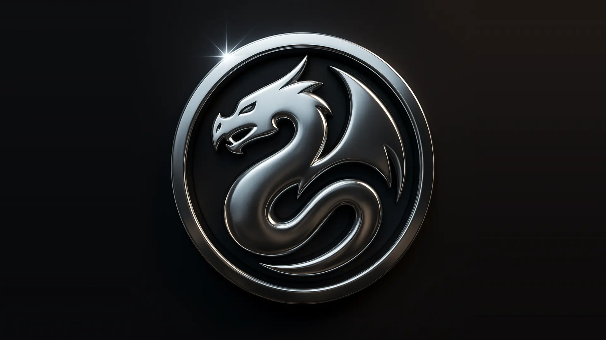

# Song of Heroic Lands: A Gateway to Adventure

  

[)].download_count&url=https://api.github.com/repos/HeroicLands/Song-of-Heroic-Lands-FoundryVTT/releases/latest&color=green>)](https://github.com/HeroicLands/Song-of-Heroic-Lands-FoundryVTT/releases/latest)

**Play the character you actually imagined.**

Song of Heroic Lands (SoHL) is a classless, skill-based fantasy system for Foundry Virtual Tabletop. No classes, no levels, no archetypes to choose between — you decide what your character knows, believes, and can do, and the system builds them from that. The grizzled sergeant who reads the stars, the physician with smuggler friends, the shepherd who speaks to spirits: here those are ordinary characters, not multiclass workarounds.

It is a world with weight. Fights are fast and genuinely dangerous, so choosing to draw steel is a real decision rather than a foregone conclusion. Wounds stay with you and need treating. And when the dice turn against you, Fate is there — a resource you spend to walk away from something that should have finished you.

- **Magic worth building a character around.** The Arcane, Divine, and Spirit traditions play differently from one another — alchemy, runecraft, astrology, tarotry, summoning, trance, spirit work. Some of it is what your character _is_: a birthsign, a state of piety, quietly colouring everything they attempt. Some of it is what your character _does_: a rite, a prayer, an invocation, rolled and resolved in the moment.
- **Grow in the direction you played.** Skills improve because you used them, not because you spent points on them. Your character finishes the campaign shaped by what actually happened to them.
- **It keeps the books; you make the calls.** SoHL tracks the wounds, the healing, the calendar, the modifiers — then asks you what you want to do. Nothing happens to your character without your say-so, and every number on the sheet shows where it came from.
- **Bring your own world.** Run it with _HârnMaster_, with the open-source **Thalorna** setting, or in a world entirely of your own. Hundreds of creatures, weapons, armour, and skills come ready to drag onto a sheet, alongside a complete rules reference you can read at the table without leaving Foundry.

## Documentation

- How to contribute: [CONTRIBUTING.md](CONTRIBUTING.md)
- Developer & API documentation hub: [kb/dev-docs/README.md](kb/dev-docs/README.md)
- Player & GM rules and guides: [heroiclands.org](https://heroiclands.org/projects/sohl/)

## Copyright

[Song of Heroic Lands](https://github.com/HeroicLands/Song-of-Heroic-Lands) Copyright &copy; 2024-2026 by Thomas Rodriguez. All rights reserved.

## License

All content under the `assets` folder is licensed under the
[Creative Commons Attribution-ShareAlike 4.0 International License](https://creativecommons.org/licenses/by-sa/4.0/) unless otherwise specified. See [`assets/LICENSE`](./assets/LICENSE) for the full text.

All other content outside of the `assets` folder is licensed under the GNU GPLv3 license. See [`src/LICENSE`](./src/LICENSE) for the full text, and [LICENSE.md](./LICENSE.md) for the terms that govern both.

### Trademarks

**"Heroic Lands," "Song of Heroic Lands," "SoHL,"** and the **coiled-dragon
device** are marks of Tom Rodriguez (&copy; 2024–2026, All Rights Reserved) and are
**not** covered by the CC-BY-SA-4.0 or GPLv3 licenses above. You may fork the
code, but a modified version must be renamed and must not use these marks — see
the _Trademarks & Service Marks_ section of [LICENSE.md](./LICENSE.md).

Song of Heroic Lands is an original work published by Heroic Lands. It is not a
derivative work of, nor a supplement to, any third-party game. SoHL is compatible
with _HârnMaster: Roleplaying in the World of Kèthîra_ but is not endorsed by,
affiliated with, licensed by, or produced by Kelestia Productions Ltd. No
HârnWorld setting content is included in the system, and no proprietary rules
text, tables, artwork, terminology, or setting material from any third-party
publisher is reproduced here.

## Discord

Please consider joining [the community on Discord](https://bit.ly/44vZ10j) to discuss **Song of Heroic Lands** and find related modules and content.

# Credits

_Song of Heroic Lands_ is built on the work of many others. The credits are
maintained in one place, and published where the people playing the game can
actually read them:

**[Credits & Attributions](https://www.heroiclands.org/sohl/doc-credits/)**

In Foundry, the same page is the **Credits** link in the Game Settings sidebar,
or the **View Credits** button on the system's settings tab.

It names the Game-Icons.net contributors, the Noun Project creators icon by icon,
every bundled typeface and the notice its license requires, the dual-license
terms, and the reserved marks. Two files ship alongside the artwork they
describe, and remain authoritative for it:

- [`assets/icons/game-icons/ATTRIBUTION.md`](./assets/icons/game-icons/ATTRIBUTION.md)
  — the per-author Game-Icons table and the CC BY 3.0 modification disclosure.
- [`assets/icons/brand/NOTICE.md`](./assets/icons/brand/NOTICE.md) — the brand
  marks, which are excepted from the content license.
