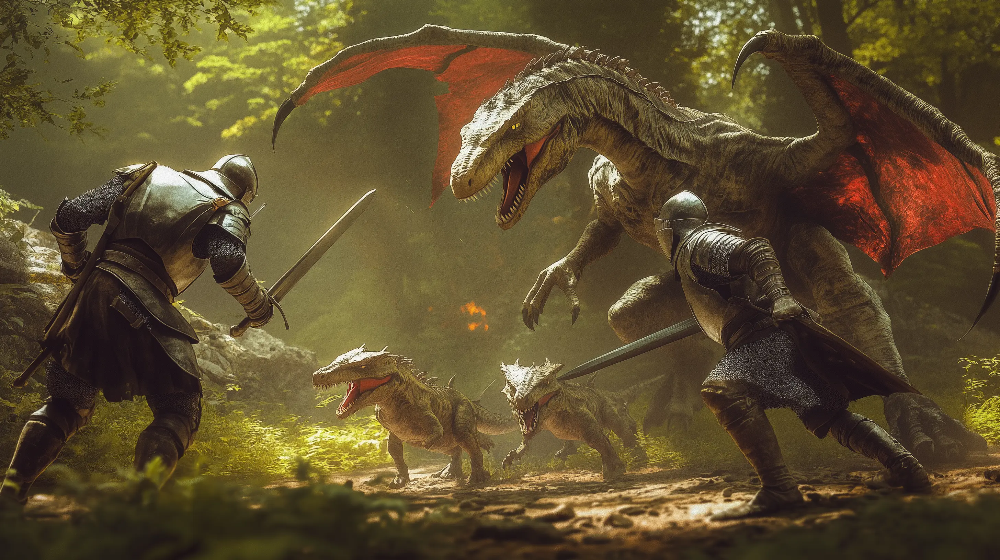

# Song of Heroic Lands — API Reference

The developer reference for the **Song of Heroic Lands (SoHL)** Foundry VTT
system, generated from the source with TypeDoc. It is intended for developers
**building against or extending** SoHL and contributors working on the system
itself.

> Looking for how to _play_? Player- and GM-facing rules, the quickstart, and
> character creation live on the project site:
> [heroiclands.org](https://heroiclands.org/projects/sohl/). This reference does
> not duplicate them.

## Where to start

- **[Architecture Overview](concepts/architecture.md)** — the mental model and a
  map of the `src/` tree. Read this first.
- **[Getting Started](how-to/getting-started.md)** — environment setup, a tour
  of the codebase, and your first change.
- **The sidebar** — every public class, function, and type, grouped to mirror
  the source (see below).

## How this reference is organized

The navigation on the left mirrors the `src/` layout, so a folder in the source
maps directly to a group here:

- **Core** — Foundry-layer foundations (system registration, data-model and
  logic bases, the `FoundryHelpers` shim, calendar, event queue).
- **Documents** — Foundry document classes by kind: **Actor**, **Item**,
  **Combat**, **Combatant**, **Chat**, **Effect**, **Scene**, **Token**.
- **Domain** — pure, Foundry-free game-mechanics objects: **Modifier**,
  **Result**, **Body**, **Action**, **Movement**, **StrikeMode**, **SkillBase**.
- **Utility** — shared helpers: **Constants**, **Helpers**, **Collection**,
  **AI**.
- **Applications** — standalone Foundry application windows.

## Guides

### Concepts — how and why the system is built

- [Architecture Overview](concepts/architecture.md)
- [Lifecycle Model](concepts/lifecycle-model.md)
- [Macros and Actions](concepts/macros-and-actions.md)
- [Assembly Architecture](concepts/assembly-architecture.md)

### How-to — task-oriented guides

- [Getting Started](how-to/getting-started.md)
- [Extension Points](how-to/extension-points.md)
- [Lifecycle Hooks](how-to/lifecycle-hooks.md)
- [The SoHL API](how-to/sohl-api.md)
- [House Rules Cookbook](how-to/house-rules-cookbook.md)
- [Testing](how-to/testing.md)

### Reference — contracts and catalogs

- [Type Catalog](reference/type-catalog.md)
- [Modifier Model](reference/modifier-model.md)
- [Combat Resolution Pipeline](reference/combat-resolution-pipeline.md)
- [Body Structure](reference/body-structure.md)
- [Effects Integration](reference/effects-integration.md)
- [Runtime Contracts](reference/runtime-contracts.md)
- [Scene, Token, and Combatant Systems](reference/scene-token-combatant.md)
- [Calendar](reference/calendar.md)
- [Event Queue](reference/event-queue.md)

### Contributing — standards and how to contribute

- [System Development](contributing/system-development.md)
- [API Docs Hosting](contributing/api-docs-hosting.md)

---

SoHL is licensed under GPL-3.0-or-later (code) and CC-BY-SA-4.0 (content). Source
on [GitHub](https://github.com/HeroicLands/Song-of-Heroic-Lands-FoundryVTT).
